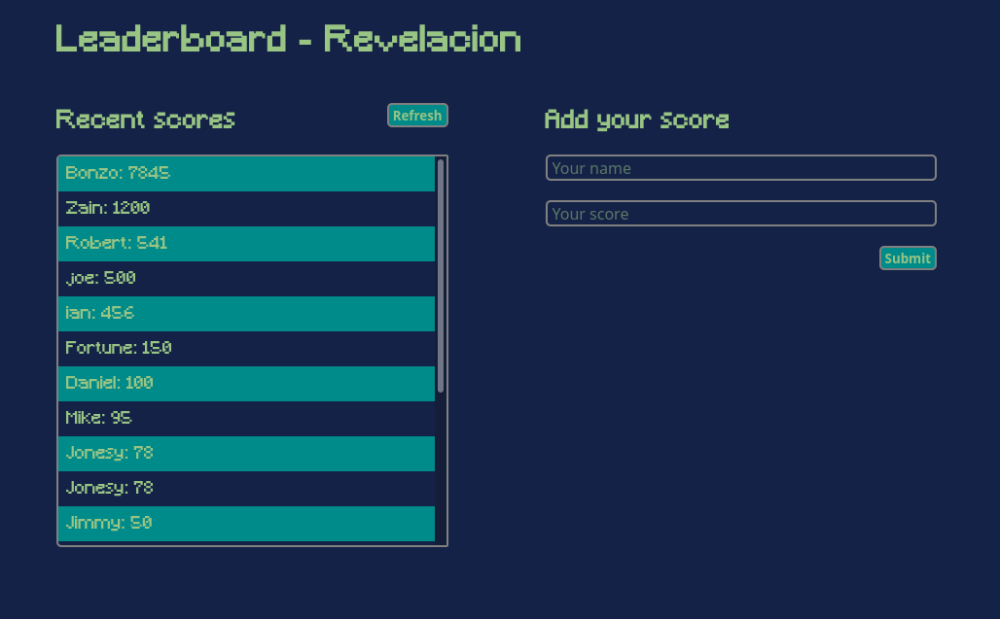

# games-leaderboard

Simple webapp to display externally-stored leaderboards for games

## Screenshot


## Built With

- HTML
- CSS3
- JavaScript

## Getting Started
**You'll need to have git and npm installed in you environment to follow these instructions.**
To get a local copy of the repository please run the following commands on your terminal:

```bash
$ cd <folder>
$ git clone https://github.com/notlfish/games-leaderboard.git
$ cd games-leaderboard
```

To be able to serve the project on your computer, you'll need to install the developer's dependencies.
```bash
$ npm install && npm install --dev
```

With this, you can use
```bash
$ npm run build
$ npm start
```
To build the project and to start a server, respectively. `npm start` should open the page in a browser by itself, if it
doesn't, you can just access `localhost:8080` to see the project.

## Author

👤 **Lucas Ferrari Soto**

- GitHub: [@notlfish](https://github.com/notlfish)
- Twitter: [@LucasFerrariSo1](https://twitter.com/LucasFerrariSo1)
- LinkedIn: [LinkedIn](https://www.linkedin.com/in/lucas-mauricio-ferrari-soto-472a3515a/)

## 🤝 Contributing

Contributions, issues and feature requests are welcome!

Feel free to check the [issues page](https://github.com/JAAR91/Awesome-books/issues).

## Acknowledgements
The app's style is inspired by [Revelación web page](https://www.ldgamesar.com/).

## Show your support

Give a ⭐️ if you like this project!

## 📝 License

[MIT](/LICENSE)
